# montecarlo-pde
The Poisson Equation, and its special case, the
Laplace Equation, are important partial differential equations
within electrostatics, as they describe the electric potential field
caused by a particular charge distribution. Solving the Poisson
equation for a given set of boundary conditions is a fundamental
problem within the field. This report describes an algorithm for a
Monte Carlo Method solution to the Poisson and Laplace
equations. Monte Carlo Method is a parallelizable non-
deterministic numerical approach towards solving this problem.
A Python implementation is also provided for three versions of the
Monte Carlo Method: Fixed Step, Semi-Floating and Full
Floating. Several examples including the one-dimensional and
two-dimensional parallel plate capacitors are performed to
illustrate the function of the implementation.


Keywords: Poisson Equation, Laplace Equation, Monte Carlo
Methods, Electrostatics, Parallel Plate Capacitor, Python
Implementation


A. One dimentional capacitor (Laplace Equation)
<p float="left">
  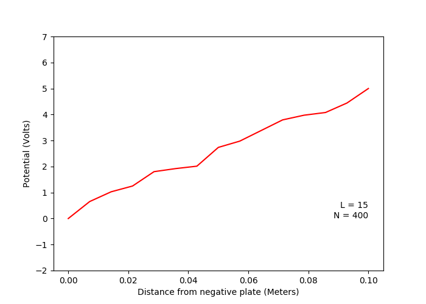
   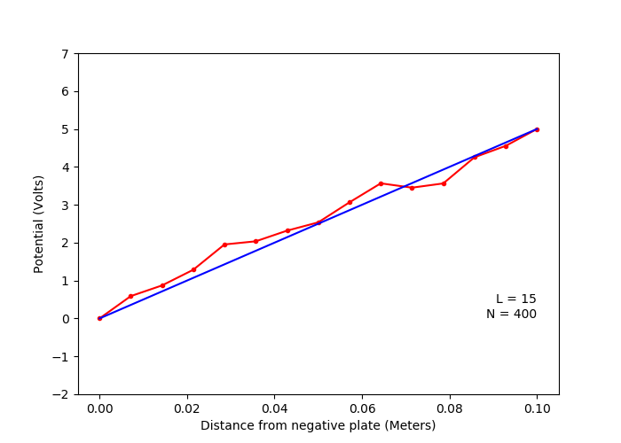
</p>

B. Variation of solution with number of random walks
(Laplace Equation)
<p float="left">
  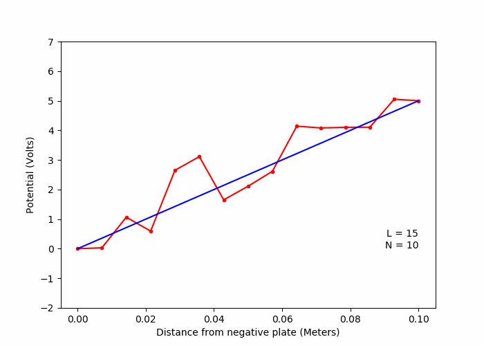
  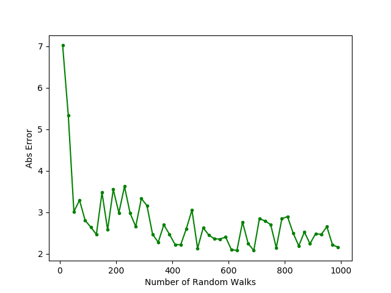 
</p>

C. Variation of solution with number of lattice points
(Laplace Equation)
<p float="left">
  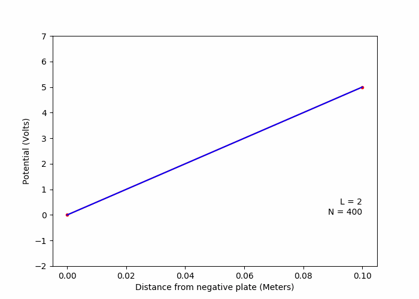
  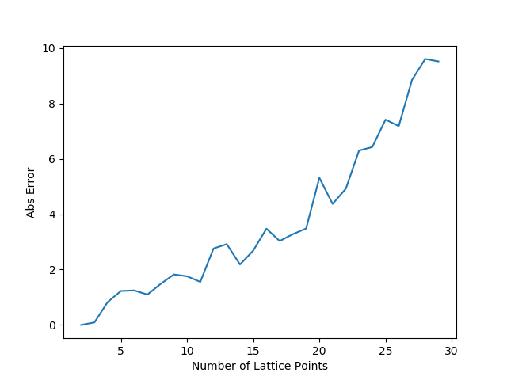 
</p>

D.One dimensional capacitor with a linear charge
distribution (Poisson Equation)
<p float="left">
  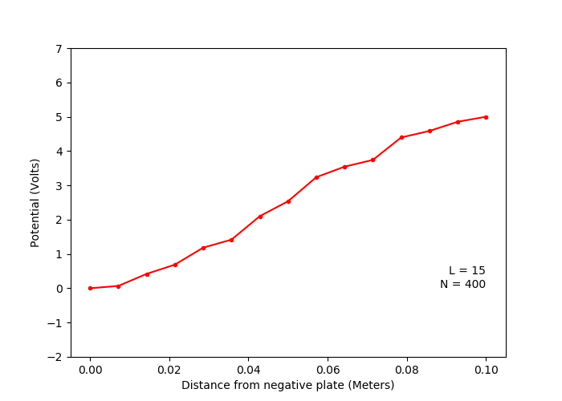
</p>

E. Two dimentional capacitor (Laplace Equation)
<p float="left">
  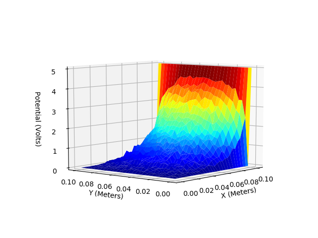
  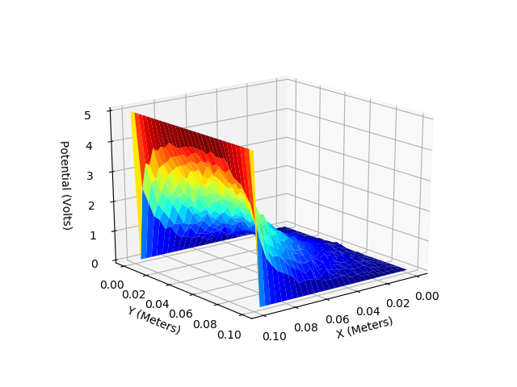 
</p>
<p float="left">
  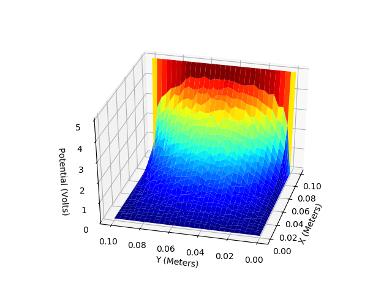
  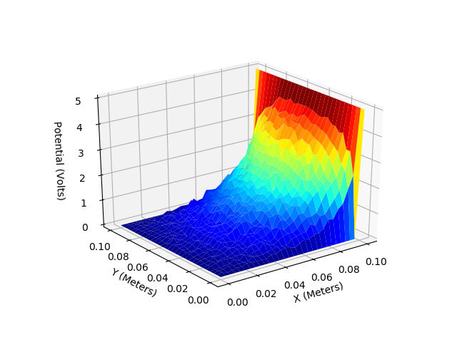 
</p>

F.Two dimentional metal box with a spherical charge in
centre (Poisson Equation)
<p float="left">
  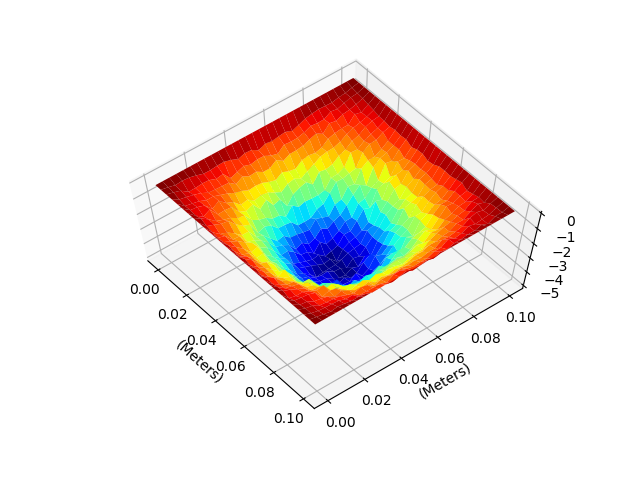
  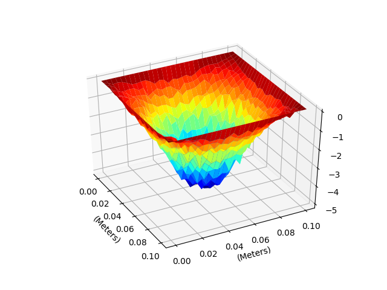 
   
</p>

G. Two dimentional metal box with a two oppositely charged
spheres (Poisson Equation)
<p float="left">
  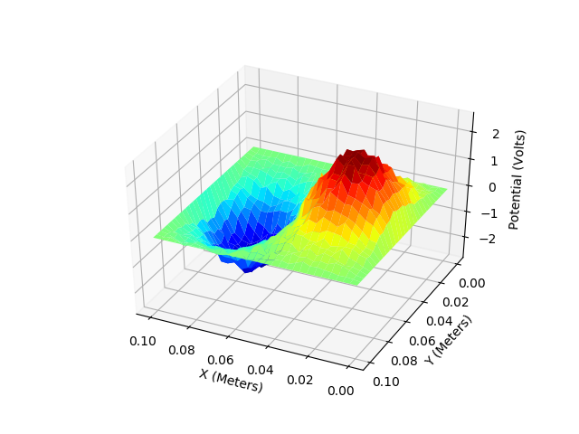
  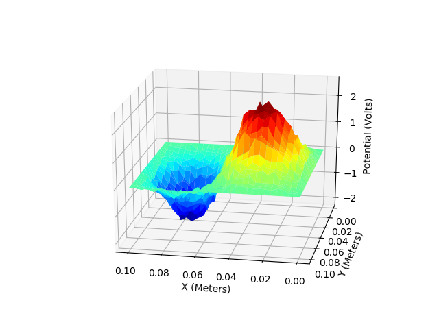 
</p>
<p float="left">
  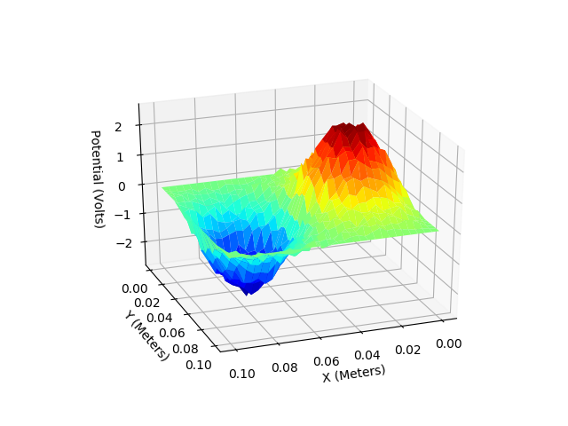
  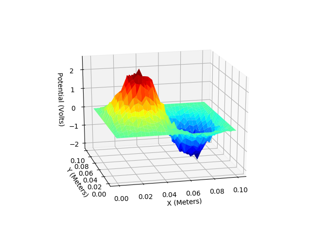 
</p>

H.Two dimentional metal box with a spherical charge at
center using semi-floating random walk algorithm
(Poisson Equation)

<p float="left">
  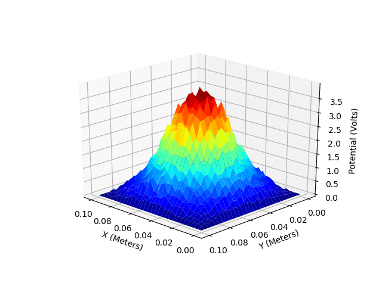
  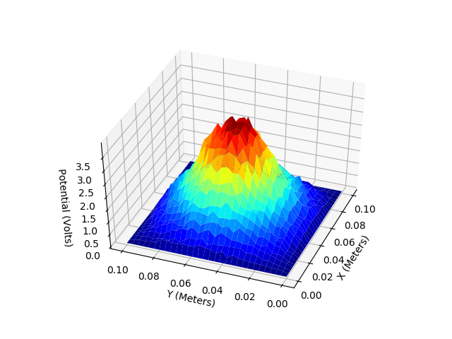 
</p>

I. Two dimentional metal box with a spherical charge at
center using full floating random walk algorithm (Poisson
Equation)
<p float="left">
  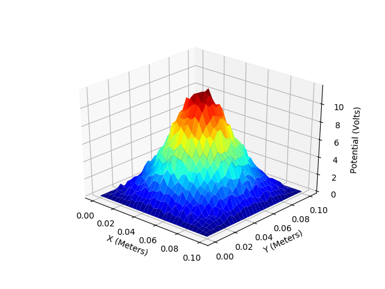
</p>

## Web Application

This repository includes a web application that allows interactive solving of PDEs using Monte Carlo methods. The application consists of:

- **Backend**: FastAPI server (`app.py`) that provides REST API endpoints
- **Frontend**: HTML/JavaScript interface (`frontend/index.html`) for running simulations

### Features

- **Interactive Interface**: Run simulations directly in your browser
- **Multiple Equation Types**: Support for both Laplace and Poisson equations
- **Configurable Parameters**: Adjust number of random walks, lattice points, and dimensions
- **Real-time Results**: View simulation results immediately
- **Responsive Design**: Works on desktop and mobile devices

### Deployment on Render

This application is ready for deployment on [Render](https://render.com/). The repository includes:

1. `render.yaml` - Render configuration file
2. `requirements.txt` - Python dependencies
3. `app.py` - FastAPI application
4. `frontend/index.html` - Web interface

#### Deploy Steps:

1. **Fork/Clone this repository** to your GitHub account
2. **Connect to Render**:
   - Sign up at [render.com](https://render.com/)
   - Connect your GitHub account
   - Select this repository
3. **Deploy**:
   - Render will automatically detect the `render.yaml` file
   - Click "Deploy" - Render will install dependencies and start the server
   - Your app will be available at `https://your-app-name.onrender.com`

#### Manual Deploy (Alternative):

If you prefer manual configuration:

1. Create a new Web Service on Render
2. Connect your GitHub repository
3. Configure:
   - **Environment**: `Python 3`
   - **Build Command**: `pip install -r requirements.txt`
   - **Start Command**: `uvicorn app:app --host 0.0.0.0 --port $PORT`

### Local Development

To run locally:

```bash
# Install dependencies
pip install -r requirements.txt

# Start the server
uvicorn app:app --reload

# Open browser to http://localhost:8000
```

### API Endpoints

- `GET /` - Serves the web interface
- `POST /simulate/laplace` - Solve Laplace equation
- `POST /simulate/poisson` - Solve Poisson equation
- `GET /api/info` - Get system information

### Example API Usage

```bash
# Solve 1D Laplace equation
curl -X POST "https://your-app.onrender.com/simulate/laplace" \
     -H "Content-Type: application/json" \
     -d '{"n": 400, "dim": 1, "lattice_points": 15}'

# Solve 2D Laplace equation
curl -X POST "https://your-app.onrender.com/simulate/laplace" \
     -H "Content-Type: application/json" \
     -d '{"n": 400, "dim": 2, "lattice_points": 20}'
```
